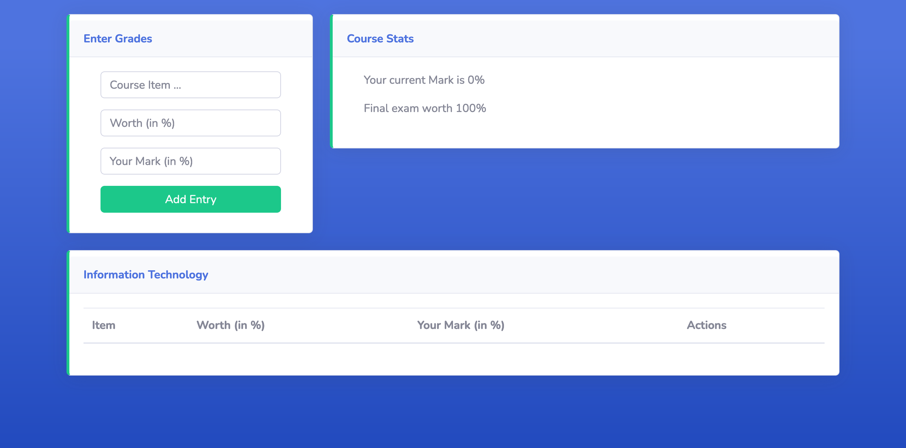

# Grade Goal Calculator

## Motivation
During my university days, I always used the UofG Mark Calculator: https://www.lib.uoguelph.ca/writing-studying/studying-resources-workshops/mark-calculator/ to keep track of my progress. Moreover, I was fascinated by the calculations and technology used to build it. Hence, I started working on this project to learn more about the calculations behind it.

There is no specific reason to pick Laravel other than challenging myself to learn something new! 

## Prerequisites
Before running the application, ensure you have the following installed:
- PHP (version 7.4 or higher)
- Composer

## Installation
- Clone this repository to your local machine:
```
git clone https://github.com/Ayush-Kaushik/grade-calculator.git
```
- Navigate to the project directory:
```
cd grade-calculator
```

- Install PHP dependencies using Composer:
```
composer install
```

## Configuration
- Create a `.env` file inside grade-calculator directory
- Copy the .env.example file to .env:
```
cp .env.example .env
```
- Generate a new application key:
```
php artisan key:generate
```
- This application does not require database configuration so it can be left to default (same as env.example)

## Running the application locally
- Navigate to project directory
- Run the following command:
```
php artisan serve
```
- The runtime logs should show where laravel Development Server is running (example shown below):
```
Starting Laravel development server: http://127.0.0.1:8000
[Mon Mar 18 10:45:11 2024] PHP 8.3.4 Development Server (http://127.0.0.1:8000) started
[Mon Mar 18 10:45:17 2024] 127.0.0.1:49502 Accepted
[Mon Mar 18 10:45:18 2024] 127.0.0.1:49502 Closing
[Mon Mar 18 10:45:19 2024] 127.0.0.1:49509 Accepted
[Mon Mar 18 10:45:19 2024] 127.0.0.1:49509 Closing
[Mon Mar 18 10:45:19 2024] 127.0.0.1:49510 Accepted
[Mon Mar 18 10:45:19 2024] 127.0.0.1:49510 [200]: GET /css/app.css
```
- Go to your browser and access the link: http://127.0.0.1:8000


## How to use Grade Goal Calculator
1. Go to the calculator application here: https://grade-goal-calculator.vercel.app/
2. Enter the name of the course on the main screen 
3. Click Add button and it will redirect you to main application screen: 
4. In the `Enter Grades` section, enter your grades. Example shown below:

5. Click on Add Entry button and the application will automatically calculate your grade goals in `Course Stats` section:

6. In case you make an error in the grades, simply click delete button to remove that entry and the calculate will automatically calculate your upgraded course stats.

## Future Plans
- Download the course stats in PDF, TXT and EXCEL formats
- Support multiple courses at once

## Contributing
Contributions are welcome!